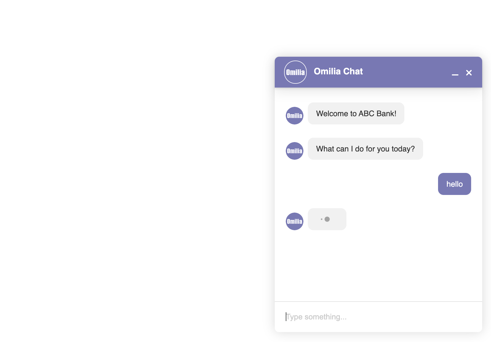

# Omilia Sample SDK



## Technologies used

- ReactJS 16
- Redux 4
- TypesScript 3

## Getting Started

First clone the repository:

```bash
$ git clone git@github.com:omilia/omilia-sample-sdk.git
$ cd omilia-sample-sdk
```

## Run webchat

In order to run the webchat you need to add some valid keys in place of `API_URL` and `API_KEY` in `index.html:34`.

If you do so you can simply run a node server locally with:

```bash
$ npx serve
```

Now, simply Open `http://localhost:5000` in your browser 😉
